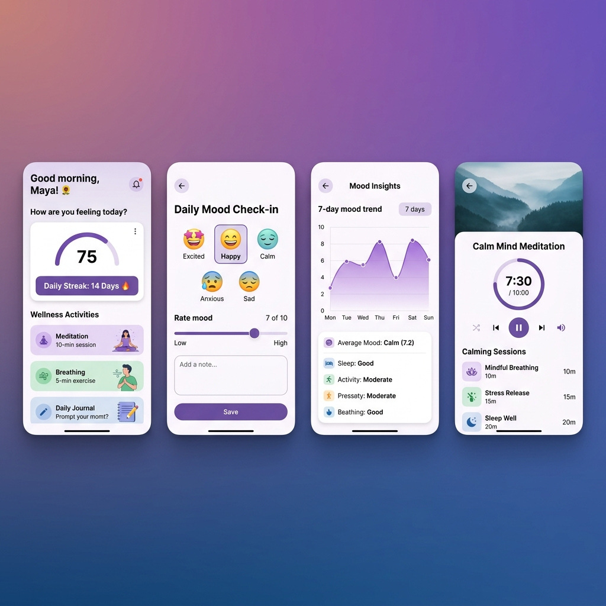
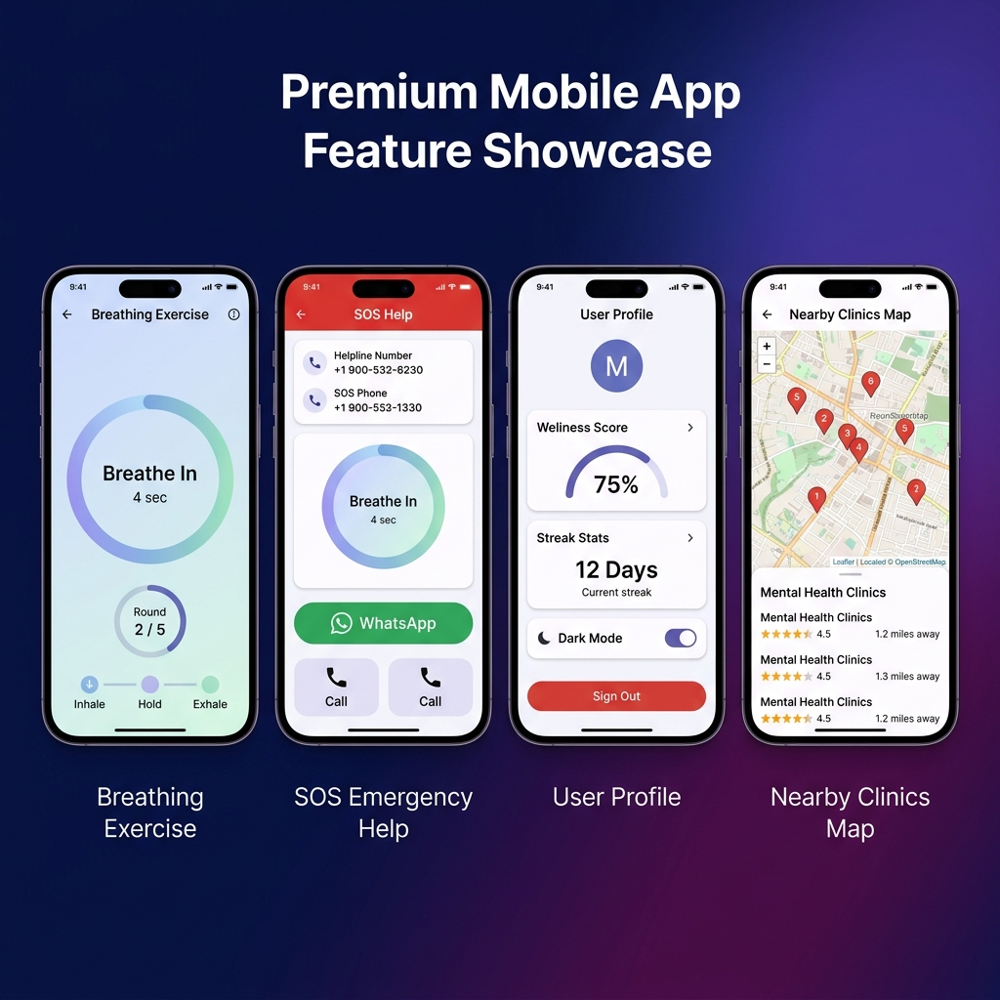

<p align="center">
  
  
  
  
  
  
</p>

<h1 align="center">🌸 MindBloom — Mental Wellness Companion</h1>

<p align="center">
  <b>A full-stack mental wellness application designed to help users track their mood,<br/>
  practice meditation, breathe mindfully, and receive AI-powered wellness recommendations.</b>
</p>

<p align="center">
  
  
  
</p>

---

## 📸 App Screenshots

<p align="center">
  
</p>

<p align="center">
  
</p>

---

## 🧠 What is MindBloom?

**MindBloom** is a holistic mental wellness application that empowers users to take charge of their emotional health through daily mood tracking, guided meditation, breathing exercises, and AI-powered personalized recommendations. The app features a beautiful Material 3 design with full dark mode support, an SOS emergency help system with real Indian helpline numbers, and a nearby clinics/bookstores map powered by OpenStreetMap.

> _"Every day is a new opportunity to bloom."_ 🌱

---

## ✨ Key Features

| Feature | Description |
|---|---|
| 🎯 **Daily Mood Check-in** | Multi-step mood logging with emoji selection, feelings/activities tagging, sleep/water/exercise tracking, and optional journaling |
| 📊 **Mood Analytics** | 7-day mood trend charts using FL Chart with beautiful gradient fills |
| 🧘 **Guided Meditation** | 6 curated meditation sessions (Calm Morning, Stress Relief, Body Scan, Sleep Prep, Focus Flow, Gratitude) with built-in audio player |
| 🌬️ **Breathing Exercise** | 4-7-8 breathing technique with animated breathing circle, phase indicators, configurable rounds (2/4/6/8) |
| 🤖 **AI Recommendations** | Google Gemini AI-powered personalized wellness suggestions (books, physical activities, mindfulness, lifestyle) with intelligent fallback system |
| 🆘 **SOS Emergency Help** | One-tap crisis support with real Indian helpline numbers (Vandrevala Foundation, iCall, NIMHANS, AASRA), WhatsApp integration, and calming breath animation |
| 🗺️ **Nearby Help** | OpenStreetMap-powered map showing nearby mental health clinics and wellness bookstores |
| 📅 **Appointment Manager** | Schedule, edit, and manage therapy/counseling appointments |
| 📈 **Wellness Tracker** | Daily tracking for sleep, water intake, exercise, and overall wellness score |
| 👤 **User Profile** | Personal stats (streak, best streak, wellness score), category selection (Student/Professional/Parent/Senior), and settings |
| 🌗 **Dark Mode** | Full dark theme support with beautiful dark color palette |
| 🔐 **Secure Auth** | JWT-based authentication with bcrypt password hashing and secure token storage |

---

## 🏗️ Architecture

```
MindBloom/
├── 📱 mindbloom_app/          # Flutter mobile application
│   └── lib/
│       ├── main.dart          # App entry point
│       ├── config/            # App configuration
│       │   ├── constants.dart # API endpoints, helplines, mood data
│       │   ├── routes.dart    # GoRouter navigation with auth guards
│       │   └── theme.dart     # Material 3 theming (light + dark)
│       ├── models/            # Data models
│       │   ├── user_model.dart
│       │   ├── mood_model.dart
│       │   ├── recommendation_model.dart
│       │   ├── appointment_model.dart
│       │   └── tracker_model.dart
│       ├── providers/         # Riverpod state management
│       │   ├── auth_provider.dart
│       │   ├── mood_provider.dart
│       │   ├── recommendation_provider.dart
│       │   └── theme_provider.dart
│       ├── services/          # API communication layer
│       │   └── api_service.dart
│       ├── screens/           # UI screens (14 feature modules)
│       │   ├── auth/          # Login & Signup
│       │   ├── onboarding/    # Welcome flow
│       │   ├── category/      # User category selection
│       │   ├── dashboard/     # Home dashboard
│       │   ├── checkin/       # Mood check-in wizard
│       │   ├── mood_history/  # Mood log history
│       │   ├── recommendations/ # AI recommendations
│       │   ├── meditation/    # Guided meditation player
│       │   ├── breathing/     # Breathing exercise
│       │   ├── nearby/        # Map-based clinic finder
│       │   ├── tracker/       # Daily wellness tracker
│       │   ├── appointments/  # Appointment management
│       │   ├── profile/       # User profile & settings
│       │   └── sos/           # Emergency support
│       └── widgets/           # Reusable UI components
│           ├── app_shell.dart     # Bottom nav shell
│           ├── custom_button.dart
│           ├── custom_card.dart
│           ├── mood_selector.dart
│           └── sos_overlay.dart   # SOS bottom sheet
│
├── 🖥️ backend/                # Node.js REST API
│   ├── server.js              # Express app entry point
│   ├── config/
│   │   └── db.js              # MongoDB Atlas connection
│   ├── middleware/
│   │   └── auth.js            # JWT authentication middleware
│   ├── models/                # Mongoose schemas
│   │   ├── User.js            # User model (bcrypt hashing)
│   │   ├── MoodLog.js         # Mood check-in logs
│   │   ├── Appointment.js     # Appointment model
│   │   └── Tracker.js         # Daily tracker model
│   ├── routes/                # API route handlers
│   │   ├── auth.js            # Signup, Login, Profile
│   │   ├── mood.js            # Check-in, History, Weekly, Latest
│   │   ├── recommendations.js # Gemini AI integration + fallback
│   │   ├── appointments.js    # CRUD appointments
│   │   └── tracker.js         # Daily tracking
│   └── .env.example           # Environment variable template
│
└── 📸 screenshots/            # App screenshots for README
```

---

## 🔌 API Endpoints

### Authentication
| Method | Endpoint | Description |
|--------|----------|-------------|
| `POST` | `/api/auth/signup` | Register a new user |
| `POST` | `/api/auth/login` | Login and receive JWT token |
| `GET` | `/api/auth/me` | Get current user profile |
| `PUT` | `/api/auth/profile` | Update user profile |
| `PUT` | `/api/auth/category` | Set user category |

### Mood Tracking
| Method | Endpoint | Description |
|--------|----------|-------------|
| `POST` | `/api/mood/checkin` | Submit daily mood check-in |
| `GET` | `/api/mood/history` | Get mood history (filterable by days) |
| `GET` | `/api/mood/weekly` | Get 7-day mood averages |
| `GET` | `/api/mood/latest` | Get most recent mood log |

### AI Recommendations
| Method | Endpoint | Description |
|--------|----------|-------------|
| `POST` | `/api/recommendations/generate` | Generate personalized recommendations via Gemini AI |

### Appointments
| Method | Endpoint | Description |
|--------|----------|-------------|
| `POST` | `/api/appointments` | Create a new appointment |
| `GET` | `/api/appointments` | List all appointments |
| `PUT` | `/api/appointments/:id` | Update an appointment |
| `DELETE` | `/api/appointments/:id` | Delete an appointment |

### Wellness Tracker
| Method | Endpoint | Description |
|--------|----------|-------------|
| `POST` | `/api/tracker` | Log daily wellness data |
| `GET` | `/api/tracker` | Get tracker history |
| `GET` | `/api/tracker/today` | Get today's tracker entry |

---

## 🛠️ Tech Stack

### Frontend (Flutter)
| Technology | Purpose |
|---|---|
| **Flutter 3.x** | Cross-platform mobile framework |
| **Dart** | Programming language |
| **Riverpod** | Reactive state management |
| **GoRouter** | Declarative routing with auth guards |
| **Dio** | HTTP client for API calls |
| **FL Chart** | Beautiful line charts for mood trends |
| **Just Audio** | Meditation audio playback |
| **Flutter Map + LatLong2** | OpenStreetMap integration |
| **Google Fonts (Inter)** | Modern typography |
| **Flutter Animate** | Smooth micro-animations |
| **Flutter Secure Storage** | Encrypted token storage |
| **Lottie** | Animated illustrations |

### Backend (Node.js)
| Technology | Purpose |
|---|---|
| **Express.js** | REST API framework |
| **MongoDB Atlas** | Cloud NoSQL database |
| **Mongoose** | MongoDB ODM with schema validation |
| **JWT (jsonwebtoken)** | Stateless authentication |
| **bcryptjs** | Password hashing (salt rounds: 12) |
| **Google Gemini API** | AI-powered recommendations |
| **node-fetch** | HTTP client for Gemini API |
| **Twilio** | SMS/call integration (optional) |

---

## 🚀 Getting Started

### Prerequisites

- **Flutter SDK** ≥ 3.11.0
- **Node.js** ≥ 18.x
- **MongoDB Atlas** account (or local MongoDB)
- **Gemini API Key** (optional — app works without it via fallback)

### 1️⃣ Clone the Repository

```bash
git clone https://github.com/Pushpendra-7-ux/MindBloom.git
cd MindBloom
```

### 2️⃣ Backend Setup

```bash
cd backend

# Install dependencies
npm install

# Configure environment variables
cp .env.example .env
# Edit .env with your MongoDB URI, JWT secret, and optionally Gemini API key

# Start the server
npm run dev
```

The API will start at `http://localhost:5001`. You should see:
```
🌸 MindBloom API running on http://0.0.0.0:5001
```

### 3️⃣ Flutter App Setup

```bash
cd mindbloom_app

# Install dependencies
flutter pub get

# Update the API base URL in lib/config/constants.dart
# Set it to your backend URL (localhost, IP, or production URL)

# Run the app
flutter run
```

### 4️⃣ Configure API URL

In `mindbloom_app/lib/config/constants.dart`, update the `baseUrl`:

```dart
// For Android emulator:
static const String baseUrl = 'http://10.0.2.2:5001';

// For iOS simulator:
static const String baseUrl = 'http://localhost:5001';

// For physical device (use your Mac's local IP):
static const String baseUrl = 'http://YOUR_IP:5001';
```

---

## 🤖 AI Recommendations — How It Works

MindBloom uses **Google Gemini 1.5 Flash** to generate personalized wellness recommendations based on:

1. **Mood Score** (1-10)
2. **Current Feelings** (happy, anxious, stressed, etc.)
3. **Recent Activities** (exercise, meditation, work, etc.)
4. **User Category** (student, professional, parent, etc.)

The AI returns structured recommendations across 4 categories:
- 📚 **Books** — Curated reading suggestions
- 🏋️ **Physical Activities** — Exercise and movement
- 🧘 **Mind & Spirit** — Meditation, breathing, journaling
- 🌿 **Lifestyle** — Habits and daily practices

**Fallback System:** If the Gemini API key is not configured or the API is unavailable, the backend returns curated fallback recommendations from a hand-picked library of 50+ wellness items, categorized by mood level (high/neutral/low).

---

## 🆘 SOS & Crisis Support

The app includes a dedicated SOS system with:
- **Indian Mental Health Helplines** — Vandrevala Foundation (24/7), iCall, NIMHANS, Snehi, AASRA
- **One-Tap Calling** — Direct phone call to helpline numbers
- **WhatsApp Integration** — Quick message to counselor
- **Calming Breath Animation** — Immediate anxiety relief while waiting

---

## 🎨 Design Philosophy

- **Material 3** with custom color system (Primary Purple `#7F77DD`, Soft Green `#1D9E75`, Warm Amber `#EF9F27`, Calm Blue `#378ADD`)
- **Google Fonts Inter** for clean, modern typography
- **Dark Mode** with curated dark palette (Dark Background `#1A1A2E`, Dark Surface `#16213E`)
- **Smooth Animations** — Page transitions, breathing circles, mood selectors, card interactions
- **Accessible Design** — Clear typography hierarchy, sufficient contrast ratios

---

## 📁 Flutter Folder Breakdown

| Folder | Files | Responsibility |
|--------|-------|----------------|
| `config/` | 3 | App-wide constants, routing, theming |
| `models/` | 5 | Data classes for User, Mood, Recommendation, Appointment, Tracker |
| `providers/` | 4 | Riverpod state management (Auth, Mood, Recommendations, Theme) |
| `services/` | 1 | Singleton Dio-based API service with JWT token management |
| `screens/` | 14 dirs | Feature-based screen modules |
| `widgets/` | 5 | Reusable components (AppShell, CustomButton, CustomCard, MoodSelector, SOSOverlay) |

**Total: 32+ Dart files** across 6 organized directories.

---

## 🧪 Running Tests

```bash
cd mindbloom_app
flutter test
```

---

## 📄 License

This project is licensed under the **MIT License** — see the [LICENSE](LICENSE) file for details.

---

## 🙏 Acknowledgments

- **Flutter Team** — For the incredible cross-platform framework
- **Google Gemini** — For powering AI recommendations
- **OpenStreetMap** — For free, open-source map tiles
- **Vandrevala Foundation, iCall, NIMHANS** — For their invaluable mental health services

---

<p align="center">
  Made with 💜 for mental wellness
  <br/>
  <b>MindBloom</b> — Bloom where you are planted 🌸
</p>
